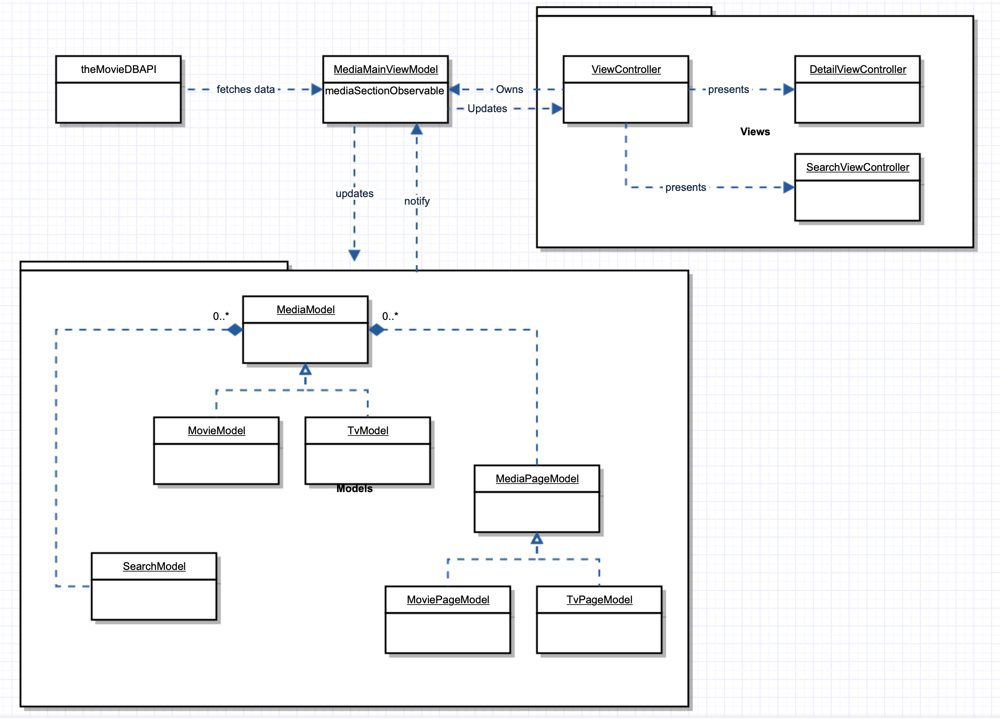

# TheMovieApp
App that fetches movies and TV shows

Application architecture

## Single responsibility principle
The single responsibility principle is the first of the SOLID. It states that all classes should have single responsibility and be encapsulated. 

## Clean code
More than often a clean code implements SOLID principle. Clean code is one that is easy to understand, change and scales. But not only code should be clean but also architecture that supports the implementation. 
But even if you write clean code, that doesn't cover other factors that developers should be aware of, such complexity, scalability, performance, amount others.